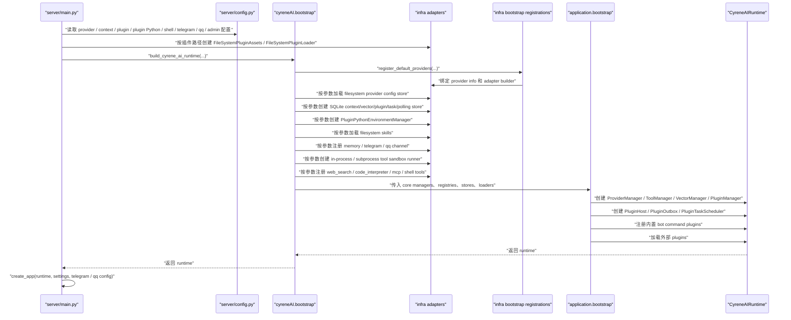
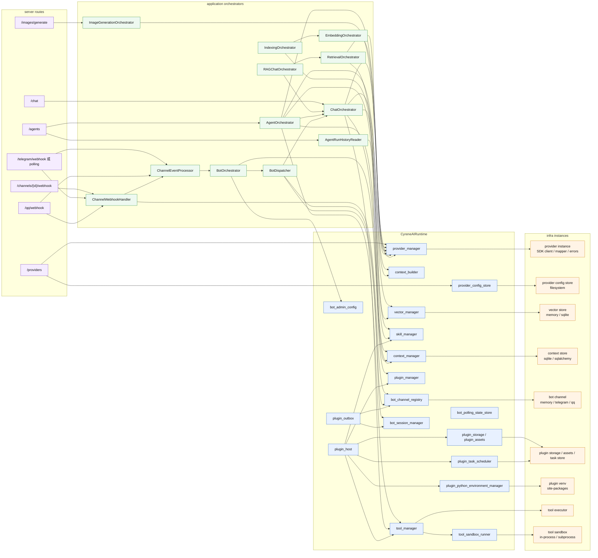

# CyreneBot Architecture

CyreneBot 的架构目标是把稳定契约、外部适配和应用编排分开。新增业务策略时优先进入 `application`；新增外部系统实现时进入 `infra/adapters`；只有稳定协议和 schema 才进入 `core`。

当前 Python 包名为 `cyreneAI`。Bot framework 的新增内核能力应优先以 channel event、bot session 和 bot action 为稳定抽象；插件开发者面向 `cyreneAI.api` 这个稳定 facade 编写插件，不直接依赖内部实现模块。

## 分层原则

```text
core
  稳定契约层：schema、protocol、manager、registry、policy、通用错误。

infra/provider_catalog
  provider 身份目录：只声明 provider info。

infra/adapters
  外部适配层：provider SDK、tool executor、skill loader、plugin loader、plugin Python environment、vector store。

adapters
  公共适配层：面向使用方的轻量 adapter 和稳定导出。

api
  插件开发公共 API：导出 CyreneBot、CyreneRouter、Depends、回复 helper 和本地测试工具。

infra/bootstrap
  装配层：注册 provider info 和 adapter builder。

application
  应用编排层：runtime、chat、embedding、indexing、retrieval、RAG chat、bot、agent、plugin host。

cyreneAI.bootstrap
  默认 composition root：把 core、application 和 infra 装成可运行 runtime。

server
  HTTP/API 层：读取环境配置，创建 HTTP/API 入口；只依赖默认 composition root、application runtime 和 server 自身模块。
```

允许依赖方向固定：

```text
core
  -> 标准库和项目无关的轻量基础库

infra/provider_catalog
  -> core/schema

infra/adapters
  -> core
  -> 外部 SDK 只允许在 adapter 内出现

infra/bootstrap
  -> core
  -> infra/provider_catalog
  -> infra/adapters

application
  -> core

api
  -> core

cyreneAI.bootstrap
  -> core
  -> application
  -> infra

server
  -> cyreneAI.bootstrap
  -> application runtime
  -> server
```

实际代码里体现为：`core` 不知道 `infra`、`application` 和 `server`；`infra` 不反向依赖 `application` 或 `server`；`application` 只面向 `core` 的 schema、protocol 和 manager 编排业务流程；`cyreneAI.api` 只承载插件作者可见的公共开发面；默认总装只落在 `cyreneAI.bootstrap`。

`cyreneAI.adapters` 是面向使用方的公共适配层。它可以放本地文件加载、轻量 factory、稳定 adapter 导出；不允许放 provider 的 `builder.py`、`instance.py`、`mapper.py`、`errors.py` 这类内部实现文件，也不放 provider 实现目录。provider 仍通过 `provider_catalog`、`infra/adapters/providers` 和 `infra/bootstrap/registrations` 治理。

`cyreneAI.api` 是面向插件开发者的 Python API。它负责让插件以普通 Python 代码声明命令、任务、事件、依赖和本地测试；命令 handler 可以用普通函数参数接收命令参数，未标注类型且无默认值的业务参数按文本解析，未标注类型但有默认值的参数会按默认值推断类型，`str`、`int`、`float`、`bool` 注解可以显式控制解析类型，`Rest[str]` 可以显式消费剩余命令文本，`Option[T]` 和 `Flag` 可以声明 `--limit 5`、`--verbose` 这类 CLI 参数，也可以用 `Depends(...)` 声明宿主能力。命令函数签名会生成 usage 和 `PluginCommandDefinition.arguments` 参数契约，供测试、管理接口和后续文档使用。`api/plugin.py` 只保留兼容 facade，内部实现按依赖、参数、回复、执行器、路由和类型别名拆到私有模块。`cyreneAI.api` 不负责启动 runtime、不负责装配 infra、不负责 HTTP 通信。HTTP 对外通信仍属于 `server`。

插件系统的设计原则是：配置权和页面权归插件作者，框架只提供入口与能力。配置不是框架运行契约，而是插件作者管理自身行为的工具；插件可以选择常量、环境变量、JSON、TOML、YAML、Pydantic、dataclass 或命令式管理方式。框架不要求 `_conf_schema.json` 这类前端表单 schema，也不把前端渲染细节作为插件发布约束。若未来提供插件设置页能力，也应是插件显式注册的 settings/page 入口，由插件 handler 读取输入、修改状态并返回 HTML/Response 或重定向；页面结构、CSS、静态资源和交互方式由插件作者决定，宿主只负责路由、权限、依赖注入、资源托管和错误隔离。

插件可以在 `plugin.json` 中显式声明 `python_dependencies`。依赖解析和安装不是插件 SDK 的职责，而是运行时能力：`core/schema/plugin.py` 只保存依赖声明，`core/plugin/plugin_protocol.py` 只定义 `PluginPythonEnvironmentManagerProtocol`；默认实现位于 `infra/adapters/plugins/python_env.py`，由 `cyreneAI.bootstrap` 按配置创建并传给 `FileSystemPluginLoader`。文件系统插件加载器在加载入口文件前确保每个插件拥有按 `plugin_id`、版本、内容 hash 和依赖列表隔离的 venv，并把插件目录和该 venv 的 `site-packages` 注入 import path。这样插件可以导入自己的库，例如 `numpy`、`pandas`，但 application 不读取环境变量、不执行 pip、不知道 venv 细节。

插件 SDK 的 PyPI 发布边界必须独立治理。PyPI 包不是源码仓库压缩包，也不是一键部署包；它只发布插件作者在开发、类型检查和本地测试中需要依赖的稳定契约。未来若拆出插件 SDK，建议使用独立发行名，例如 `cyreneai-plugin-sdk`，避免和完整运行时的顶层包名互相覆盖。

插件 SDK 必须包含：

```text
插件声明、路由、命令、事件、任务、middleware 的公共 API
插件依赖注入、参数解析、回复归一化和类型辅助
插件开发所需的 core schema、protocol、errors 中的稳定最小子集
PluginTestClient 及其默认 fake 依赖
py.typed、README、LICENSE 和包元数据
```

插件 SDK 可以包含：

```text
小型示例片段
插件模板
面向插件作者的简短文档
仅用于 SDK 自测的轻量测试辅助
只生成插件项目骨架的快捷初始化命令，例如 cyrene-plugin init
```

插件 SDK 禁止包含：

```text
server、bootstrap、application runtime、infra adapter
provider SDK、外部数据库 adapter、具体 channel 实现
Dockerfile、docker-compose、部署脚本、CI 配置
前端源码、前端构建产物、设计稿、截图
完整 examples 仓库、大体积 fixtures、真实服务配置
.env、密钥样例、运行时数据目录
```

SDK 的依赖也必须保持轻。允许稳定类型、schema 和测试所需的基础依赖；禁止因为 SDK 发布而引入 `openai`、`anthropic`、`google-genai`、`fastapi`、`uvicorn`、数据库驱动或任何 provider 专属 SDK。完整运行时、HTTP server、前端管理页和 Docker 镜像应走独立发布物，由运行时包、release artifact 或镜像承担。

SDK CLI 只服务插件开发者的本地项目初始化和静态辅助，不启动宿主 server，不拉起 provider，不写入 Docker 或前端工程，不替插件作者生成业务配置 schema。初始化模板必须是最小可运行插件项目，包含 `plugin.json`、入口文件和基于 `PluginTestClient` 的本地测试。

构建配置必须使用白名单，而不是把 `src` 整棵树自动打进包里。发布前必须检查 wheel 和 sdist 内容，确认分发物只包含上述 SDK 边界内的文件；如果出现 Docker、前端、server、infra adapter 或完整 examples，发布即视为失败。

## 真实运行架构

单张“分层图”很容易把系统画平。CyreneBot 实际上有三条主线：模块边界、启动装配、请求运行时。

### 模块边界

这张图表达 import/依赖边界，不表达单次请求的调用顺序：

```mermaid
flowchart TB
  subgraph USERS["使用方"]
    app_user["业务代码"]
    http_user["HTTP / Telegram / QQ 客户端"]
    plugin_user["插件项目"]
  end

  subgraph PUBLIC["公共入口"]
    public_adapters["cyreneAI.adapters\n轻量 loader / factory / facade"]
    public_api["cyreneAI.api\n插件开发 API / facade"]
    server_api["cyreneAI.server\nFastAPI routes / app"]
    root["cyreneAI.bootstrap\n默认 composition root"]
  end

  subgraph APP["application\n用例编排层"]
    app_boot["application.bootstrap\n创建 CyreneAIRuntime"]
    runtime["CyreneAIRuntime\n持有 managers / registries / stores"]
    app_chat["chat"]
    app_agent["agent\nplanning / tool use / history"]
    app_generation["generation\nembedding / image"]
    app_knowledge["knowledge\nindexing / retrieval / vector"]
    app_bot["bot / channels"]
    app_plugins["plugins\nhost / outbox / tasks"]
  end

  subgraph CORE["core\n稳定契约和规则"]
    schemas["schema"]
    provider_core["provider\nfactory / manager / registry / protocol"]
    context_core["context\nbuilder / manager / policy / protocol"]
    tool_core["tool\nregistry / manager / protocol"]
    skill_core["skill\nregistry / manager / protocol"]
    vector_core["vector\nmanager / protocol"]
    bot_core["bot\nchannel / session / polling protocol"]
    plugin_core["plugin\nregistry / manager / protocol"]
    errors["errors"]
  end

  subgraph INFRA["infra\n外部系统实现"]
    catalog["provider_catalog\n*_info.py"]
    provider_regs["infra.bootstrap.registrations\n注册 provider builder"]
    provider_adapters["provider adapters\nopenai_compatible / openai_responses / anthropic / google_genai"]
    provider_config_adapters["provider config stores\nfilesystem"]
    channel_adapters["channel adapters\nmemory / telegram / qq"]
    bot_session_adapters["bot session stores\nmemory"]
    bot_polling_adapters["bot polling state stores\nmemory / sqlite"]
    vector_adapters["vector stores\nmemory / sqlite"]
    skill_adapters["skill loaders\nfilesystem"]
    plugin_adapters["plugin adapters\nfilesystem / sqlite / python env"]
    tool_adapters["tool executors\npython callable / http / subprocess / shell / mcp"]
    tool_sandbox_adapters["tool sandbox runners\nin-process / subprocess"]
    database["database\nsqlite / sqlalchemy"]
  end

  app_user --> public_adapters
  app_user --> root
  http_user --> server_api
  plugin_user --> public_api

  server_api --> root
  server_api --> runtime
  public_adapters --> schemas
  public_adapters --> vector_adapters
  public_adapters --> skill_adapters
  public_adapters --> tool_adapters
  public_api --> schemas
  public_api --> plugin_core

  root --> app_boot
  root --> provider_regs
  root --> provider_config_adapters
  root --> channel_adapters
  root --> bot_session_adapters
  root --> bot_polling_adapters
  root --> vector_adapters
  root --> skill_adapters
  root --> plugin_adapters
  root --> tool_adapters
  root --> tool_sandbox_adapters
  root --> database

  app_boot --> runtime
  app_boot --> provider_core
  app_boot --> context_core
  app_boot --> tool_core
  app_boot --> vector_core
  app_boot --> plugin_core
  app_boot --> bot_core

  runtime --> app_chat
  runtime --> app_agent
  runtime --> app_generation
  runtime --> app_knowledge
  runtime --> app_bot
  runtime --> app_plugins

  app_chat --> provider_core
  app_chat --> context_core
  app_chat --> tool_core
  app_chat --> skill_core
  app_agent --> provider_core
  app_agent --> context_core
  app_agent --> tool_core
  app_agent --> skill_core
  app_generation --> provider_core
  app_knowledge --> provider_core
  app_knowledge --> vector_core
  app_bot --> bot_core
  app_bot --> plugin_core
  app_plugins --> plugin_core
  app_plugins --> tool_core
  app_plugins --> skill_core

  provider_regs --> catalog
  provider_regs --> provider_adapters
  provider_regs --> provider_core
  provider_adapters --> provider_core
  provider_adapters --> schemas
  provider_adapters --> errors
  provider_config_adapters --> provider_core
  channel_adapters --> bot_core
  bot_session_adapters --> bot_core
  bot_polling_adapters --> bot_core
  vector_adapters --> vector_core
  skill_adapters --> skill_core
  plugin_adapters --> plugin_core
  tool_adapters --> tool_core
  tool_sandbox_adapters --> tool_core
  database --> context_core

  classDef public fill:#f5ecff,stroke:#7b45c6,color:#111;
  classDef app fill:#e8f1ff,stroke:#3267c8,color:#111;
  classDef core fill:#eef9f0,stroke:#2f8f46,color:#111;
  classDef infra fill:#fff4e6,stroke:#d18419,color:#111;
  classDef user fill:#f7f7f7,stroke:#777,color:#111;

  class app_user,http_user,plugin_user user;
  class public_adapters,public_api,server_api,root public;
  class app_boot,runtime,app_chat,app_agent,app_generation,app_knowledge,app_bot,app_plugins app;
  class schemas,provider_core,context_core,tool_core,skill_core,vector_core,bot_core,plugin_core,errors core;
  class catalog,provider_regs,provider_adapters,provider_config_adapters,channel_adapters,bot_session_adapters,bot_polling_adapters,vector_adapters,skill_adapters,plugin_adapters,tool_adapters,tool_sandbox_adapters,database infra;
```



### 启动装配

这张图表达 `server/main.py` 和 `cyreneAI.bootstrap` 如何把默认运行时组装出来：



### 请求运行时

这张图表达 runtime 内部的真实调用关系：routes 不直接调用 SDK，orchestrator 只找 runtime 里的 manager/protocol，具体外部实现落到 infra adapter。



## Bot 管理员边界

Bot 管理员身份不是 channel adapter 的硬编码规则，也不是插件自己判断的字符串约定。默认链路为：

```text
server/config.py
  -> 读取 CYRENEAI_BOT_ADMIN_USER_IDS
  -> 构造 core/schema/application.py::BotAdminConfig
  -> cyreneAI.bootstrap / application.bootstrap
  -> CyreneAIRuntime.bot_admin_config
  -> BotOrchestrator 根据 event.user_id 注入 request.metadata["is_admin"] = True
  -> PluginCommandRequest.is_admin
  -> PluginManager 执行 admin_required 命令权限检查
```

`CYRENEAI_BOT_ADMIN_USER_IDS` 支持逗号或分号分隔，例如 `123456789,987654321`。`server/config.py` 是读取 `.env` 和环境变量的唯一默认入口；`application` 只消费已经装配好的 `BotAdminConfig` 和 bot event，不读取环境变量。插件只看 `PluginCommandRequest.is_admin`，不关心 Telegram、HTTP 或其他 channel 的用户标识格式。

## 插件 Python 运行环境

插件依赖环境是宿主运行时能力，不属于 application 编排逻辑：

```text
plugin.json python_dependencies
  -> core/schema/plugin.py::PluginManifest.python_dependencies
  -> FileSystemPluginLoader
  -> PluginPythonEnvironmentManager.ensure(...)
  -> {root}/{plugin_id}/{environment_key}/.venv
  -> pip install dependencies
  -> 注入插件目录和 venv site-packages
  -> import 插件 entrypoint
```

默认环境根目录是 `data/plugin_venvs`，可由 `CYRENEAI_PLUGIN_PYTHON_ENVIRONMENT_ROOT_PATH` 覆盖；`CYRENEAI_PLUGIN_PYTHON_AUTO_INSTALL=false` 时，如果插件声明依赖但对应环境不存在，应失败而不是隐式安装；`CYRENEAI_PLUGIN_PYTHON_INSTALL_TIMEOUT_SECONDS` 控制创建 venv 和安装依赖的超时。环境 key 绑定插件 id、版本、内容 hash 和依赖列表，依赖或插件内容变化时创建新环境，旧环境不会被 application 直接管理。

## 工具与 Shell 安全边界

工具 schema、权限枚举和执行策略属于 `core/schema/tool.py` 与 `core/tool`；具体执行器属于 `infra/adapters/tools`。默认工具注册由 `cyreneAI.bootstrap` 控制，server 只负责把 env 配置解析成参数。受控 shell 是内置工具能力之一，但默认关闭：

```text
CYRENEAI_CONTROLLED_SHELL_ENABLED=true
  -> cyreneAI.bootstrap
  -> infra/adapters/tools/shell.py::register_controlled_shell_tool
  -> ToolRegistry 注册 shell
```

shell 工具使用 `ShellCommandPolicy` 做 allow/review/deny 分类，默认拒绝 shell 控制符、管道、重定向和命令串联；工作目录被限制在 `CYRENEAI_SHELL_CWD_ROOT_PATH` 或启动目录之下，超时由 `CYRENEAI_SHELL_TIMEOUT_SECONDS` 控制。`CYRENEAI_SHELL_COMMAND_POLICY_JSON` 可以覆盖默认策略，但策略 schema 仍在 `core/schema/tool.py`，执行和进程调用仍在 `infra/adapters/tools/shell.py`。

默认策略的意图是把边界钉死：

```text
allow
  pwd / ls / cat / head / tail / rg / grep / where / which
  git status/log/diff/show 等只读子命令
  python --version / node --version / npm --version / uv version

review
  uv / pip / python / npm / npx / node / curl / wget / git 等可能改变环境或访问网络的命令

deny
  rm / del / rmdir / format / mkfs / shutdown / sudo / shell 启动器等高风险命令
```

需要审核的命令只有在工具参数中显式带上 `review_approved=true` 才会执行；权限判断仍会经过 `ToolManager` 的工具选择、权限和风险等级策略。

## Agent 主路径

Agent 入口有三类，但运行时只保留一条 application 编排路径：

```text
/agents/run
  -> server.routes.agents
  -> build_agent_run_request
  -> AgentOrchestrator

bot AGENT 模式
  -> channel webhook / channel events
  -> ApplicationBotRequest(message_response_mode="agent")
  -> BotOrchestrator
  -> build_agent_run_request
  -> AgentOrchestrator

plugin agent.chat/result
  -> PluginContext.agent
  -> build_agent_run_request
  -> AgentOrchestrator
```

这些入口都会携带同一组 Agent 运行参数：

```text
required_skill_names
max_skills
planning
tool_selection
memory_retrieval
```

其中 bot 请求为了和普通 chat 参数区分，字段名使用 `agent_planning`、`agent_tool_selection`、`agent_memory_retrieval`，进入 application 后会转换为 `AgentRunRequest.planning`、`tool_selection`、`memory_retrieval`。

`AgentOrchestrator` 的职责是应用层编排，不直接理解 provider 差异：

```text
AgentRunRequest
  -> 读取 session history
  -> 选择并注入 skill bundle
  -> 注入 planning runtime hint
  -> 执行 memory retrieval 并注入 memory context
  -> 依据 tool_selection 和 skill policy 过滤工具
  -> 调用 provider manager
  -> 执行工具调用
  -> 达到 max_steps 时发起 finalization 请求
  -> 持久化上下文快照
```

`planning` 目前是运行提示，plan metadata 中的模式为 `runtime_hint`。它用于把目标、skill 和 memory 等提示组织进上下文，不负责独立拆解任务、评估步骤或动态改写工具策略。若后续需要真正的 planner，应新增独立 planner step 和对应 schema，让 planner 先产出可审计计划，再由 Agent loop 执行；不要继续扩大静态 `_build_agent_plan`，也不要把 provider 专属规划能力泄漏到 `core` 或 `application`。

## RAG 主路径

当前 RAG 主路径完全由 `application` 层编排：

```text
IndexingOrchestrator
  Document
  -> chunk_strategy
  -> EmbeddingProviderProtocol.embed
  -> VectorManager.upsert

RetrievalOrchestrator
  query
  -> EmbeddingProviderProtocol.embed
  -> VectorManager.search

RAGChatOrchestrator
  retrieval result
  -> ContextSegmentRole.RETRIEVED
  -> ChatOrchestrator
  -> ChatProviderProtocol.chat
```

`collection_id`、`chunk_strategy`、RAG context format 这类能力都是应用策略，因此留在 `application`。vector store 只处理 `VectorRecord`、`VectorQuery` 和 `VectorSearchResult`，不理解 RAG。

## OpenAI-Compatible 供应商差异

`openai_compatible` 是协议适配器，不是具体厂商身份。供应商差异优先作为协议语言翻译处理，避免把厂商规则扩散到 `core` 或 `application`。

处理原则：

1. 标准字段默认走 mapper 基础路径。
2. 非标准请求或响应字段只在 `infra/adapters/providers/openai_compatible` 内处理。
3. 是否启用某个 quirk 由 provider instance 根据 `ProviderConfig` 判断。
4. `core` 不出现具体供应商名称。
5. `application` 不处理供应商协议差异。
6. 能力失败后的降级由 manager 或 application 编排，不放进 mapper。
7. 每个 quirk 必须有 mapper 或 instance 单测；真实 API 测试缺少环境变量时必须 skip。

落点约定：

```text
请求字段差异
  -> infra/adapters/providers/openai_compatible/mapper.py

响应字段差异
  -> infra/adapters/providers/openai_compatible/mapper.py

错误语义差异
  -> infra/adapters/providers/openai_compatible/errors.py

是否启用差异规则
  -> infra/adapters/providers/openai_compatible/instance.py

实时能力发现
  -> provider instance

实时能力失败后的退步
  -> core provider manager 或 application orchestrator
```

例如 DeepSeek thinking tool-call 需要回传 `reasoning_content`，这是 OpenAI-compatible 供应商差异：`mapper` 提供可选字段映射，`instance` 根据 provider 配置启用，`core` 只保存通用 `Message.metadata`，`application` 不认识 DeepSeek。

## OpenAI Responses 工具历史约束

`openai_responses` 是另一个 provider adapter，协议细节同样只允许落在 `infra/adapters/providers/openai_responses`。Responses API 对工具历史有更强约束：发送给 API 的历史里，每个 `function_call` 都必须有匹配的 `function_call_output`。因此落点分为两层：

```text
application/chat
  -> 不把仍包含 tool_calls 的 assistant 中间态保存进上下文快照

infra/adapters/providers/openai_responses/mapper.py
  -> 映射请求时过滤历史中没有 function_call_output 的孤儿 function_call
```

第一层避免新增污染，第二层兼容已经存在的旧上下文。这不是通用 chat schema 规则，而是 Responses 协议发送前的适配规则；不能把 `function_call_output` 配对逻辑扩散到 `core` 或其他 provider mapper。其他 provider 若有类似约束，也应在各自 adapter 内做协议映射和兼容。

## 边界守护

分层边界由测试守住，不只依赖人工 review。核心边界测试位于 `src/cyreneAI/tests/test_infra_provider_boundaries.py`，覆盖：

```text
provider_catalog 只允许 info 文件
core 不 import 外部 SDK、infra、application、server、adapters
provider_catalog 只 import core/schema
provider adapter 目录只允许 __init__.py、builder.py、errors.py、instance.py、mapper.py
provider adapters 不 import application 或 server
infra 不 import application 或 server
bootstrap registrations 只装配 core、catalog、adapters、infra bootstrap
application 不 import infra 或 server
application 不定义 CyreneAISchema 派生类
application 不定义公开 dataclass DTO，明确白名单除外
只有 core/schema 可以定义 CyreneAISchema 派生类
application 顶层目录按用例分组
```

同时还有模块级边界测试守住 `core/context`、`core/skill`、`core/tool`、`core/vector` 等子域不 import infra 或外部 SDK；公共 adapter facade 测试守住 `cyreneAI.adapters` 不泄露 application、infra bootstrap 或 provider catalog；公共插件 API facade 测试守住 `cyreneAI.api` 作为插件开发入口，正式示例和测试都通过 `from cyreneAI.api import ...` 使用插件 DSL；本地测试 harness 由 `tests/test_api_testing.py` 覆盖，确保插件命令、事件和任务不用启动 server 或完整 runtime 也能被 pytest 驱动。

当前验收命令：

```bash
uv run python -m compileall src
uv run pytest src\cyreneAI\tests
```

最近一次本地验收结果：

```text
compileall 通过
670 passed, 6 skipped
```

## 扩展落点

新增 provider：

```text
infra/provider_catalog/{provider}_info.py
infra/adapters/providers/{provider}/
infra/bootstrap/registrations/{provider}.py
tests
```

新增 vector store：

```text
infra/adapters/vector_stores/{store}/
tests
```

对外稳定导出：

```text
adapters/vector_stores/__init__.py
```

新增公共 document loader：

```text
adapters/documents/
tests
```

新增 RAG、索引、检索策略：

```text
application/*_orchestrator.py
tests/test_application_*.py
```

新增稳定 schema 或 protocol：

```text
core/schema/
core/*/*_protocol.py
tests
```

新增插件开发 API：

```text
api/
tests/test_public_api_facade.py
tests/test_api_testing.py
```

新增插件运行时依赖能力：

```text
core/schema/plugin.py
core/plugin/plugin_protocol.py
infra/adapters/plugins/python_env.py
infra/adapters/plugins/filesystem/loader.py
cyreneAI.bootstrap
tests/test_plugin_python_environment.py
tests/test_filesystem_plugin_loader.py
```

新增工具 executor 或内置工具：

```text
core/schema/tool.py
core/tool/
infra/adapters/tools/{tool_name}/ 或 infra/adapters/tools/{tool_name}.py
cyreneAI.bootstrap
adapters/tools/__init__.py
tests/test_*tool*.py
```

新增 server 环境配置：

```text
server/config.py
server/main.py
cyreneAI.bootstrap 或 application.bootstrap
tests/test_server_app.py
```

## 验证约定

常规验证：

```bash
uv run python -m compileall src
uv run pytest src/cyreneAI/tests
```

真实 API 测试必须在缺少环境变量时 `skip`，不能失败。OpenAI-compatible 真实测试使用：

```text
OPENAI_COMPATIBLE_API_KEY 或 OPENAI_API_KEY
OPENAI_COMPATIBLE_BASE_URL 或 OPENAI_BASE_URL
OPENAI_COMPATIBLE_MODEL 或 OPENAI_MODEL
OPENAI_COMPATIBLE_EMBEDDING_MODEL 或 OPENAI_EMBEDDING_MODEL
```
