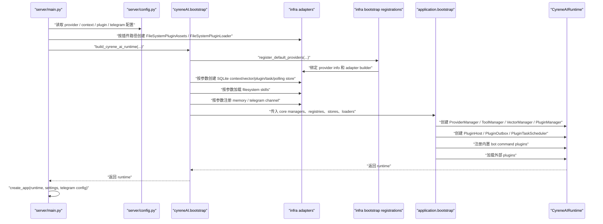
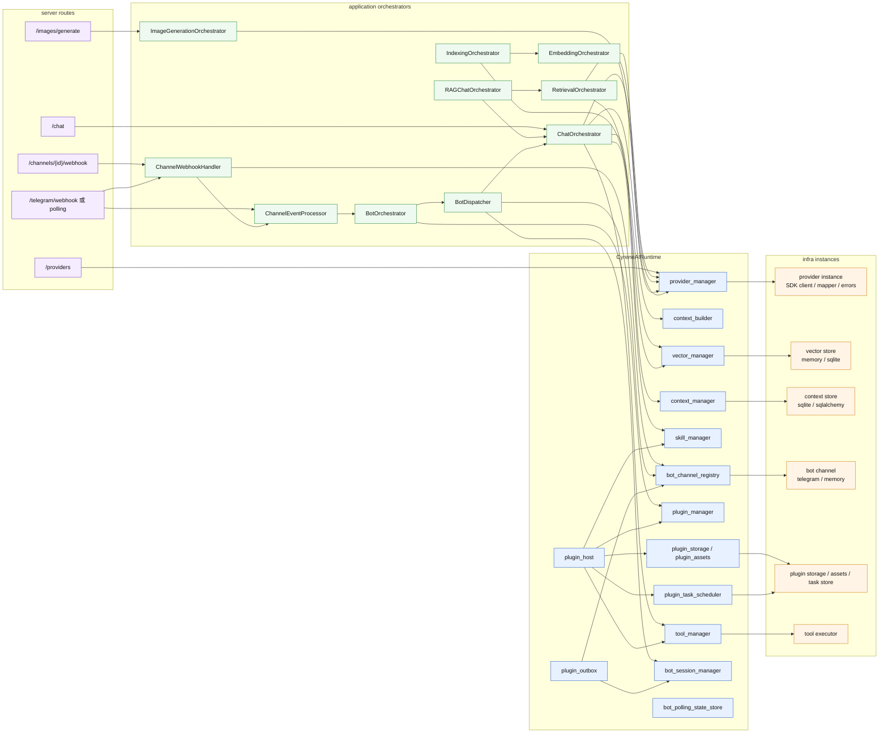

# CyreneBot Architecture

CyreneBot 的架构目标是把稳定契约、外部适配和应用编排分开。新增业务策略时优先进入 `application`；新增外部系统实现时进入 `infra/adapters`；只有稳定协议和 schema 才进入 `core`。

当前 Python 包名仍为 `cyreneAI`，这是兼容已有导入路径的过渡安排。Bot framework 的新增内核能力应优先以 channel event、bot session 和 bot action 为稳定抽象。

## 分层原则

```text
core
  稳定契约层：schema、protocol、manager、registry、policy、通用错误。

infra/provider_catalog
  provider 身份目录：只声明 provider info。

infra/adapters
  外部适配层：provider SDK、tool executor、skill loader、vector store。

adapters
  公共适配层：面向使用方的轻量 adapter 和稳定导出。

infra/bootstrap
  装配层：注册 provider info 和 adapter builder。

application
  应用编排层：runtime、chat、embedding、indexing、retrieval、RAG chat。

cyreneAI.bootstrap
  默认 composition root：把 core、application 和 infra 装成可运行 runtime。

server
  HTTP/API 层：只依赖默认 composition root、application runtime 和 server 自身模块。
```

允许依赖方向固定：

```text
core
  -> 标准库和项目无关的轻量基础库

infra/provider_catalog
  -> core/schema

infra/adapters
  -> core
  -> 外部 SDK 只允许在 adapter 内出现

infra/bootstrap
  -> core
  -> infra/provider_catalog
  -> infra/adapters

application
  -> core

cyreneAI.bootstrap
  -> core
  -> application
  -> infra

server
  -> cyreneAI.bootstrap
  -> application runtime
  -> server
```

实际代码里体现为：`core` 不知道 `infra`、`application` 和 `server`；`infra` 不反向依赖 `application` 或 `server`；`application` 只面向 `core` 的 schema、protocol 和 manager 编排业务流程；默认总装只落在 `cyreneAI.bootstrap`。

`cyreneAI.adapters` 是面向使用方的公共适配层。它可以放本地文件加载、轻量 factory、稳定 adapter 导出；不允许放 provider 的 `builder.py`、`instance.py`、`mapper.py`、`errors.py` 这类内部实现文件，也不放 provider 实现目录。provider 仍通过 `provider_catalog`、`infra/adapters/providers` 和 `infra/bootstrap/registrations` 治理。

## 真实运行架构

单张“分层图”很容易把系统画平。CyreneBot 实际上有三条主线：模块边界、启动装配、请求运行时。

### 模块边界

这张图表达 import/依赖边界，不表达单次请求的调用顺序：

```mermaid
flowchart TB
  subgraph USERS["使用方"]
    app_user["业务代码"]
    http_user["HTTP / Telegram 客户端"]
    plugin_user["插件项目"]
  end

  subgraph PUBLIC["公共入口"]
    public_adapters["cyreneAI.adapters\n轻量 loader / factory / facade"]
    plugin_api["cyreneAI.plugin_api\n插件注册 API"]
    server_api["cyreneAI.server\nFastAPI routes / app"]
    root["cyreneAI.bootstrap\n默认 composition root"]
  end

  subgraph APP["application\n用例编排层"]
    app_boot["application.bootstrap\n创建 CyreneAIRuntime"]
    runtime["CyreneAIRuntime\n持有 managers / registries / stores"]
    app_chat["chat"]
    app_generation["generation\nembedding / image"]
    app_knowledge["knowledge\nindexing / retrieval / vector"]
    app_bot["bot / channels"]
    app_plugins["plugins\nhost / outbox / tasks"]
  end

  subgraph CORE["core\n稳定契约和规则"]
    schemas["schema"]
    provider_core["provider\nfactory / manager / registry / protocol"]
    context_core["context\nbuilder / manager / policy / protocol"]
    tool_core["tool\nregistry / manager / protocol"]
    skill_core["skill\nregistry / manager / protocol"]
    vector_core["vector\nmanager / protocol"]
    bot_core["bot\nchannel / session / polling protocol"]
    plugin_core["plugin\nregistry / manager / protocol"]
    errors["errors"]
  end

  subgraph INFRA["infra\n外部系统实现"]
    catalog["provider_catalog\n*_info.py"]
    provider_regs["infra.bootstrap.registrations\n注册 provider builder"]
    provider_adapters["provider adapters\nopenai_compatible / openai_responses / anthropic / google_genai"]
    channel_adapters["channel adapters\ntelegram / memory"]
    vector_adapters["vector stores\nmemory / sqlite"]
    skill_adapters["skill loaders\nfilesystem"]
    plugin_adapters["plugin adapters\nfilesystem / sqlite"]
    tool_adapters["tool executors\npython / http / subprocess"]
    database["database\nsqlite / sqlalchemy"]
  end

  app_user --> public_adapters
  app_user --> root
  http_user --> server_api
  plugin_user --> plugin_api

  server_api --> root
  server_api --> runtime
  public_adapters --> schemas
  public_adapters --> vector_adapters
  public_adapters --> skill_adapters
  plugin_api --> schemas
  plugin_api --> plugin_core

  root --> app_boot
  root --> provider_regs
  root --> channel_adapters
  root --> vector_adapters
  root --> skill_adapters
  root --> plugin_adapters
  root --> database

  app_boot --> runtime
  app_boot --> provider_core
  app_boot --> context_core
  app_boot --> tool_core
  app_boot --> vector_core
  app_boot --> plugin_core
  app_boot --> bot_core

  runtime --> app_chat
  runtime --> app_generation
  runtime --> app_knowledge
  runtime --> app_bot
  runtime --> app_plugins

  app_chat --> provider_core
  app_chat --> context_core
  app_chat --> tool_core
  app_chat --> skill_core
  app_generation --> provider_core
  app_knowledge --> provider_core
  app_knowledge --> vector_core
  app_bot --> bot_core
  app_bot --> plugin_core
  app_plugins --> plugin_core
  app_plugins --> tool_core
  app_plugins --> skill_core

  provider_regs --> catalog
  provider_regs --> provider_adapters
  provider_regs --> provider_core
  provider_adapters --> provider_core
  provider_adapters --> schemas
  provider_adapters --> errors
  channel_adapters --> bot_core
  vector_adapters --> vector_core
  skill_adapters --> skill_core
  plugin_adapters --> plugin_core
  tool_adapters --> tool_core
  database --> context_core

  classDef public fill:#f5ecff,stroke:#7b45c6,color:#111;
  classDef app fill:#e8f1ff,stroke:#3267c8,color:#111;
  classDef core fill:#eef9f0,stroke:#2f8f46,color:#111;
  classDef infra fill:#fff4e6,stroke:#d18419,color:#111;
  classDef user fill:#f7f7f7,stroke:#777,color:#111;

  class app_user,http_user,plugin_user user;
  class public_adapters,plugin_api,server_api,root public;
  class app_boot,runtime,app_chat,app_generation,app_knowledge,app_bot,app_plugins app;
  class schemas,provider_core,context_core,tool_core,skill_core,vector_core,bot_core,plugin_core,errors core;
  class catalog,provider_regs,provider_adapters,channel_adapters,vector_adapters,skill_adapters,plugin_adapters,tool_adapters,database infra;
```



### 启动装配

这张图表达 `server/main.py` 和 `cyreneAI.bootstrap` 如何把默认运行时组装出来：



### 请求运行时

这张图表达 runtime 内部的真实调用关系：routes 不直接调用 SDK，orchestrator 只找 runtime 里的 manager/protocol，具体外部实现落到 infra adapter。



## RAG 主路径

当前 RAG 主路径完全由 `application` 层编排：

```text
IndexingOrchestrator
  Document
  -> chunk_strategy
  -> EmbeddingProviderProtocol.embed
  -> VectorManager.upsert

RetrievalOrchestrator
  query
  -> EmbeddingProviderProtocol.embed
  -> VectorManager.search

RAGChatOrchestrator
  retrieval result
  -> ContextSegmentRole.RETRIEVED
  -> ChatOrchestrator
  -> ChatProviderProtocol.chat
```

`collection_id`、`chunk_strategy`、RAG context format 这类能力都是应用策略，因此留在 `application`。vector store 只处理 `VectorRecord`、`VectorQuery` 和 `VectorSearchResult`，不理解 RAG。

## OpenAI-Compatible 供应商差异

`openai_compatible` 是协议适配器，不是具体厂商身份。供应商差异优先作为协议语言翻译处理，避免把厂商规则扩散到 `core` 或 `application`。

处理原则：

1. 标准字段默认走 mapper 基础路径。
2. 非标准请求或响应字段只在 `infra/adapters/providers/openai_compatible` 内处理。
3. 是否启用某个 quirk 由 provider instance 根据 `ProviderConfig` 判断。
4. `core` 不出现具体供应商名称。
5. `application` 不处理供应商协议差异。
6. 能力失败后的降级由 manager 或 application 编排，不放进 mapper。
7. 每个 quirk 必须有 mapper 或 instance 单测；真实 API 测试缺少环境变量时必须 skip。

落点约定：

```text
请求字段差异
  -> infra/adapters/providers/openai_compatible/mapper.py

响应字段差异
  -> infra/adapters/providers/openai_compatible/mapper.py

错误语义差异
  -> infra/adapters/providers/openai_compatible/errors.py

是否启用差异规则
  -> infra/adapters/providers/openai_compatible/instance.py

实时能力发现
  -> provider instance

实时能力失败后的退步
  -> core provider manager 或 application orchestrator
```

例如 DeepSeek thinking tool-call 需要回传 `reasoning_content`，这是 OpenAI-compatible 供应商差异：`mapper` 提供可选字段映射，`instance` 根据 provider 配置启用，`core` 只保存通用 `Message.metadata`，`application` 不认识 DeepSeek。

## 边界守护

分层边界由测试守住，不只依赖人工 review。核心边界测试位于 `src/cyreneAI/tests/test_infra_provider_boundaries.py`，覆盖：

```text
provider_catalog 只允许 info 文件
core 不 import 外部 SDK、infra、application、server、adapters
provider_catalog 只 import core/schema
provider adapter 目录只允许 __init__.py、builder.py、errors.py、instance.py、mapper.py
provider adapters 不 import application 或 server
infra 不 import application 或 server
bootstrap registrations 只装配 core、catalog、adapters、infra bootstrap
application 不 import infra 或 server
application 不定义 CyreneAISchema 派生类
application 不定义公开 dataclass DTO，明确白名单除外
只有 core/schema 可以定义 CyreneAISchema 派生类
application 顶层目录按用例分组
```

同时还有模块级边界测试守住 `core/context`、`core/skill`、`core/tool`、`core/vector` 等子域不 import infra 或外部 SDK；公共 adapter facade 测试守住 `cyreneAI.adapters` 不泄露 application、infra bootstrap 或 provider catalog。

当前验收命令：

```bash
uv run python -m compileall src
uv run pytest src\cyreneAI\tests
```

最近一次本地验收结果：

```text
compileall 通过
467 passed, 8 skipped
```

## 扩展落点

新增 provider：

```text
infra/provider_catalog/{provider}_info.py
infra/adapters/providers/{provider}/
infra/bootstrap/registrations/{provider}.py
tests
```

新增 vector store：

```text
infra/adapters/vector_stores/{store}/
tests
```

对外稳定导出：

```text
adapters/vector_stores/__init__.py
```

新增公共 document loader：

```text
adapters/documents/
tests
```

新增 RAG、索引、检索策略：

```text
application/*_orchestrator.py
tests/test_application_*.py
```

新增稳定 schema 或 protocol：

```text
core/schema/
core/*/*_protocol.py
tests
```

## 验证约定

常规验证：

```bash
uv run python -m compileall src
uv run pytest src/cyreneAI/tests
```

真实 API 测试必须在缺少环境变量时 `skip`，不能失败。OpenAI-compatible 真实测试使用：

```text
OPENAI_COMPATIBLE_API_KEY 或 OPENAI_API_KEY
OPENAI_COMPATIBLE_BASE_URL 或 OPENAI_BASE_URL
OPENAI_COMPATIBLE_MODEL 或 OPENAI_MODEL
OPENAI_COMPATIBLE_EMBEDDING_MODEL 或 OPENAI_EMBEDDING_MODEL
```
