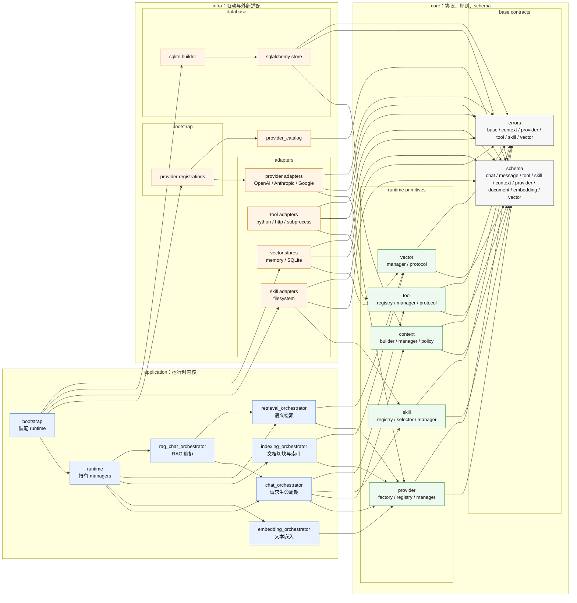

# CyreneBot Architecture

CyreneBot 的架构目标是把稳定契约、外部适配和应用编排分开。新增业务策略时优先进入 `application`；新增外部系统实现时进入 `infra/adapters`；只有稳定协议和 schema 才进入 `core`。

当前 Python 包名仍为 `cyreneAI`，这是兼容已有导入路径的过渡安排。Bot framework 的新增内核能力应优先以 channel event、bot session 和 bot action 为稳定抽象。

## 分层原则

```text
core
  稳定契约层：schema、protocol、manager、registry、policy、通用错误。

infra/provider_catalog
  provider 身份目录：只声明 provider info。

infra/adapters
  外部适配层：provider SDK、tool executor、skill loader、vector store。

adapters
  公共适配层：面向使用方的轻量 adapter 和稳定导出。

infra/bootstrap
  装配层：注册 provider info 和 adapter builder。

application
  应用编排层：runtime、chat、embedding、indexing、retrieval、RAG chat。
```

依赖方向固定：

```text
core -> infra
core/infra -> application
```

实际代码里体现为：`core` 不知道 `infra` 和 `application`；`infra` 不反向依赖 `application`；`application` 可以组合 `core` 和 `infra` 提供的能力。

`cyreneAI.adapters` 是面向使用方的公共适配层。它可以放本地文件加载、轻量 factory、稳定 adapter 导出；不允许放 provider 的 `builder.py`、`instance.py`、`mapper.py`、`errors.py` 这类内部实现文件，也不放 provider 实现目录。provider 仍通过 `provider_catalog`、`infra/adapters/providers` 和 `infra/bootstrap/registrations` 治理。

## 架构图



## RAG 主路径

当前 RAG 主路径完全由 `application` 层编排：

```text
IndexingOrchestrator
  Document
  -> chunk_strategy
  -> EmbeddingProviderProtocol.embed
  -> VectorManager.upsert

RetrievalOrchestrator
  query
  -> EmbeddingProviderProtocol.embed
  -> VectorManager.search

RAGChatOrchestrator
  retrieval result
  -> ContextSegmentRole.RETRIEVED
  -> ChatOrchestrator
  -> ChatProviderProtocol.chat
```

`collection_id`、`chunk_strategy`、RAG context format 这类能力都是应用策略，因此留在 `application`。vector store 只处理 `VectorRecord`、`VectorQuery` 和 `VectorSearchResult`，不理解 RAG。

## OpenAI-Compatible 供应商差异

`openai_compatible` 是协议适配器，不是具体厂商身份。供应商差异优先作为协议语言翻译处理，避免把厂商规则扩散到 `core` 或 `application`。

处理原则：

1. 标准字段默认走 mapper 基础路径。
2. 非标准请求或响应字段只在 `infra/adapters/providers/openai_compatible` 内处理。
3. 是否启用某个 quirk 由 provider instance 根据 `ProviderConfig` 判断。
4. `core` 不出现具体供应商名称。
5. `application` 不处理供应商协议差异。
6. 能力失败后的降级由 manager 或 application 编排，不放进 mapper。
7. 每个 quirk 必须有 mapper 或 instance 单测；真实 API 测试缺少环境变量时必须 skip。

落点约定：

```text
请求字段差异
  -> infra/adapters/providers/openai_compatible/mapper.py

响应字段差异
  -> infra/adapters/providers/openai_compatible/mapper.py

错误语义差异
  -> infra/adapters/providers/openai_compatible/errors.py

是否启用差异规则
  -> infra/adapters/providers/openai_compatible/instance.py

实时能力发现
  -> provider instance

实时能力失败后的退步
  -> core provider manager 或 application orchestrator
```

例如 DeepSeek thinking tool-call 需要回传 `reasoning_content`，这是 OpenAI-compatible 供应商差异：`mapper` 提供可选字段映射，`instance` 根据 provider 配置启用，`core` 只保存通用 `Message.metadata`，`application` 不认识 DeepSeek。

## 扩展落点

新增 provider：

```text
infra/provider_catalog/{provider}_info.py
infra/adapters/providers/{provider}/
infra/bootstrap/registrations/{provider}.py
tests
```

新增 vector store：

```text
infra/adapters/vector_stores/{store}/
tests
```

对外稳定导出：

```text
adapters/vector_stores/__init__.py
```

新增公共 document loader：

```text
adapters/documents/
tests
```

新增 RAG、索引、检索策略：

```text
application/*_orchestrator.py
tests/test_application_*.py
```

新增稳定 schema 或 protocol：

```text
core/schema/
core/*/*_protocol.py
tests
```

## 验证约定

常规验证：

```bash
uv run python -m compileall src
uv run pytest src/cyreneAI/tests
```

真实 API 测试必须在缺少环境变量时 `skip`，不能失败。OpenAI-compatible 真实测试使用：

```text
OPENAI_COMPATIBLE_API_KEY 或 OPENAI_API_KEY
OPENAI_COMPATIBLE_BASE_URL 或 OPENAI_BASE_URL
OPENAI_COMPATIBLE_MODEL 或 OPENAI_MODEL
OPENAI_COMPATIBLE_EMBEDDING_MODEL 或 OPENAI_EMBEDDING_MODEL
```
